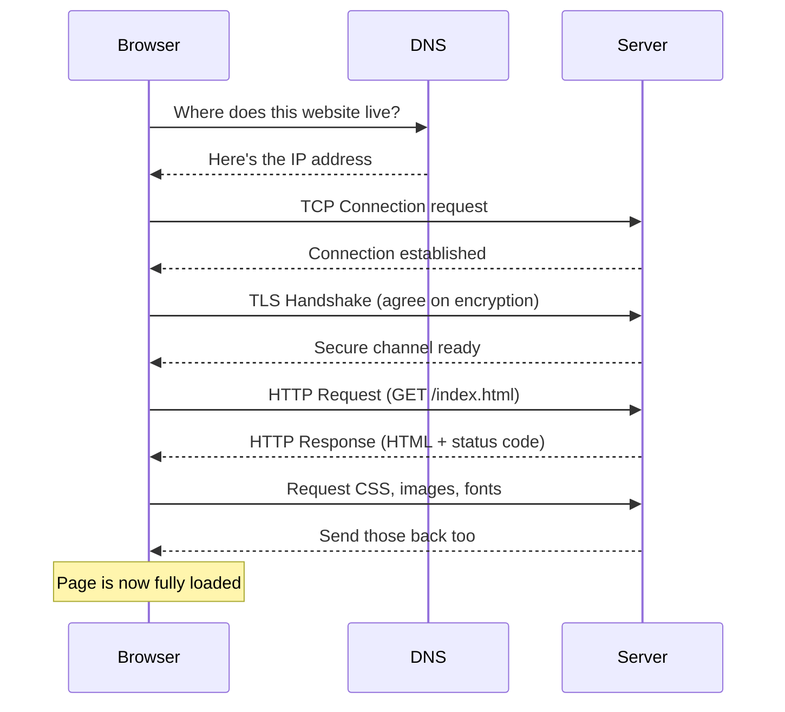
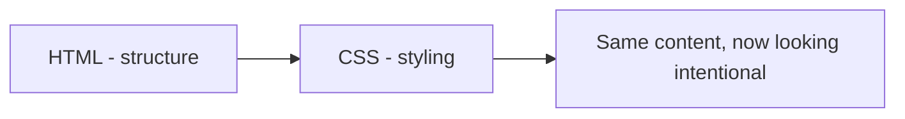

# My Web Development Learning Journey

This is where I'm putting down everything I've learned so far. Not just finished assignments, but the actual concepts, in simple words, the way I understood them.

---

# Projects

## 1. HTTP Under the Hood

Live Demo: https://tanushreenegi-dev.github.io/http-under-the-hood/

Before this, I thought a website just "appears" when you press Enter. Turns out there's a whole back and forth happening between the browser and a server, and HTTP is the set of rules they follow to talk to each other.

The way I understood it - think of ordering food at a restaurant.

- You are the browser
- The waiter is HTTP
- The kitchen is the server
- The food is the response

You don't go into the kitchen yourself. You tell the waiter, the waiter goes and tells the kitchen, and brings the food back. HTTP is just the messenger carrying requests and responses back and forth.

### What happens when you hit Enter

**Step 1: DNS Lookup**
Browser finds the site's IP address (this is DNS). This confused me at first since I didn't get why the browser needs an "address" when I already typed the website name. Turns out the name is just for humans to remember easily, computers actually talk using IP addresses (just numbers). DNS is basically a phonebook - give it a name, get back the number. If the browser already knows it from before (cached), it skips this step.

⬇

**Step 2: TCP Connection**
Before any data can be sent, the browser and server set up a TCP connection - basically a reliable channel between the two, so data doesn't get lost or arrive out of order. Think of it like both sides agreeing "ok, we're connected, go ahead."

⬇

**Step 3: TLS Handshake**
If the site uses HTTPS (which most do now), there's one more step before anything is sent - the TLS handshake. This is where the browser and server agree on how to encrypt everything, and the server proves its identity using a certificate. This is the part that makes the padlock icon show up in the address bar. I used to think http vs https was just a small detail, but this handshake is literally what keeps your data private from anyone snooping on the network.

⬇

**Step 4: Send Request**
Browser sends a request to that address. This is where it actually reaches out and asks the server for something, using HTTP.

⬇

**Step 5: Server Processes It**
Server receives the request and figures out what to do with it - finding the right file, checking if it exists, running backend code if needed.

⬇

**Step 6: Server Sends Response**
Server sends back a response with a status code, headers, and the actual content. This is where you find out if it worked (200) or something went wrong (like a 404).

⬇

**Step 7: Browser Downloads HTML**
Browser gets the actual HTML document first, since that's the base structure everything else depends on.

⬇

**Step 8: Browser Downloads Everything Else**
Browser goes back for CSS, images, fonts, scripts etc, one by one, since these aren't part of the first file, just referenced inside it.

⬇

**Step 9: Page Renders**
Everything comes together and shows up on screen. By this point most of the actual work already happened behind the scenes.

Here's the same flow as a diagram:



### HTTP Request

A request is just the browser asking for something. For example:

```
GET /index.html HTTP/1.1
```

This line tells the server what method it's using, what it wants, and which version of HTTP.

Methods I learned:

| Method | Meaning |
|--------|---------|
| GET | get/show me something |
| POST | send new data |
| PUT | update existing data |
| DELETE | remove something |

At first I thought GET is the only one that matters since it's what happens when you just open a page. But then I realized every time you submit a form, log in, upload something, or delete a post, it's using one of these other methods behind the scenes. So the browser isn't just "reading" websites, it's also constantly sending data using these different methods, just not something you usually see.

### HTTP Response

The response has a status code, some headers, and the actual content (body).

```
200 OK
Content-Type: text/html
```

The status code is the part I check the most now when something goes wrong. Before this I used to just see a blank page or an error and not know what was happening. Now if I open DevTools and see a 404, I know the file path is probably wrong. If I see a 500, I know it's a server side problem, not something in my HTML/CSS. The headers are extra info that comes along with the response, like what type of content it is, so the browser knows how to handle it (like whether to display it as a webpage, download it as a file, etc).

### Status codes I keep seeing

| Code | Meaning |
|------|---------|
| 200 | success |
| 301 | moved permanently |
| 400 | bad request |
| 401 | unauthorized |
| 403 | forbidden |
| 404 | not found |
| 500 | server error |

### Things I learned

- HTTP is stateless - meaning the server doesn't remember your last request, every request stands on its own.
- One webpage load is not one request. The HTML comes first, then CSS, JS, images, fonts all come as separate requests.
- I thought loading a site was one request. When I opened DevTools and watched the network tab, I saw a single page can trigger dozens of requests, sometimes more.

---

## 2. Resume Website (Pure HTML)

Live Demo: https://tanushreenegi-dev.github.io/resume/

No CSS at all in this one, on purpose. The point was to only focus on HTML and understand it properly instead of relying on styling to fix things.

HTML is basically the skeleton of a page. It decides what each piece of content is, not how it looks.

Tags I used:

- html, head, body
- h1 to h6 for headings
- p for paragraphs
- img for images
- a for links
- ul, ol, li for lists
- section, article for grouping content
- footer

### Semantic HTML

It's easy to just use div for everything, but div doesn't tell you what the content actually is. Semantic tags do:

- header - top of the page
- nav - the menu
- main - the main content
- section - a block of related content
- article - self contained content
- footer - bottom of the page

Why it matters:

- Screen readers use this structure, so it helps accessibility
- Search engines understand your page better (SEO)
- It's easier to read your own code later

### Why I didn't just use div, span, or table for everything

- div is a generic block with no meaning attached. Using it everywhere makes the code hard to read later, since you can't tell what any div actually is without checking class names.
- span is the same idea but inline, meant for styling small bits of text. Using it for bigger content breaks the layout since it doesn't take a full line by default.
- table was never meant for page layout, only for actual data like a spreadsheet. Old sites used tables to build layouts, but it makes the HTML messy, breaks accessibility (screen readers try to read it as data), and doesn't resize well on different screens.

So I stuck to proper tags like section, article, and header instead of using these three as shortcuts.

---

## 3. Resume (HTML + CSS)

Live Demo: https://tanushreenegi-dev.github.io/Personal-portfolio/resume.html

Same content as project 2, but now styled. If HTML is the skeleton, CSS is what makes it actually look like something - colors, fonts, spacing, layout.



### CSS Syntax

```css
selector {
  property: value;
}
```

Example:

```css
h1 {
  color: pink;
}
```

### Selectors

| Type | Example | Targets |
|------|---------|---------|
| Element | p | every p tag |
| Class | .card | elements with class="card" |
| ID | #header | the element with id="header" |
| Universal | * | everything |
| Group | h1, h2 | h1 and h2 together |
| Descendant | nav a | a tags inside nav |

### Box Model

This one confused me a lot at first. Every element is basically a box with content, padding, border, and margin around it.

```
margin (space outside the box)
  border (the edge)
    padding (space inside the box)
      content (actual text/image)
```

I kept mixing up padding and margin. Padding is space inside the border, margin is space outside it.

### Display values

- block - full width, new line
- inline - only as wide as content
- inline-block - inline but you can set width/height
- flex - flexbox layout
- grid - grid layout

### Flexbox

Used for aligning things in a row or column. Before learning flexbox I was trying to align things using margins and it kept breaking on different screen sizes. With flexbox I just set display:flex on the parent, and then I can control how the children line up without doing manual math for spacing.

```
Flex container (display: flex)
+------------------------------------------+
|  [Item 1]   [Item 2]   [Item 3]           |
+------------------------------------------+
        justify-content → spacing this way
```

```
flex-direction: column
+------------+
|  [Item 1]  |
|  [Item 2]  |
|  [Item 3]  |
+------------+
```

Properties: display:flex, justify-content, align-items, flex-direction, gap

- justify-content controls spacing along the main direction (left to right usually)
- align-items controls alignment the other way (top to bottom)
- flex-direction switches between row and column
- gap adds space between items without needing margin on each one separately

### Grid

Flexbox is good for one row or one column at a time. Grid is for when you need both rows and columns together, like a gallery of cards or a dashboard layout. I used it in the portfolio project to arrange the project cards evenly instead of them stacking randomly.

```
Grid container (display: grid)
+-----------+-----------+-----------+
| Item 1    | Item 2    | Item 3    |
+-----------+-----------+-----------+
| Item 4    | Item 5    | Item 6    |
+-----------+-----------+-----------+
   grid-template-columns: 1fr 1fr 1fr
```

### Position

- static - default
- relative - relative to its normal position
- absolute - relative to nearest positioned parent
- fixed - stays in place even when scrolling
- sticky - normal until a scroll point, then sticks

### Responsive Design

Website should look fine on phone, tablet, and desktop.

Viewport tag:

```html
<meta name="viewport" content="width=device-width, initial-scale=1.0">
```

Media query:

```css
@media (max-width: 768px) {
  /* styles for smaller screens */
}
```

---

## 4. Personal Portfolio

Live Demo: https://tanushreenegi-dev.github.io/Personal-portfolio/

This is where all of the above comes together in one full site - about section, project cards, contact section, navigation.

Building this made me realize writing code is only part of it. Organizing files properly, naming things sensibly, keeping it readable matters just as much.

---

# Git & GitHub

Git tracks changes to my code over time so I can go back if something breaks.
GitHub is where I host my Git repos online.

### Basic workflow

```
Working Directory
     |
  git add
     |
Staging Area
     |
  git commit
     |
Local Repository
     |
  git push
     |
GitHub
```

### Commands

- git init - start tracking a folder
- git status - see what's changed
- git add . - stage changes
- git commit -m "message" - save a snapshot
- git push - upload to GitHub
- git pull - download latest changes
- git clone - copy a repo
- git branch - list/create branches
- git checkout - switch branches
- git merge - combine branches

---

# Hosting with GitHub Pages

GitHub Pages hosts static sites for free, straight from a repo.

Steps:

1. Push code to GitHub
2. Go to repo Settings
3. Go to Pages
4. Pick the branch
5. Save
6. GitHub gives you a live link

### Why folder structure matters here

GitHub Pages looks for an index.html file to know what to show as the homepage. If index.html isn't sitting in the right place (usually the root of the repo, or inside a docs folder if that's what's selected in settings), the site either won't load or shows a 404 instead of your actual page. This is something I ran into directly - my project folder needed to look like this for the live link to actually work:

```
project (root)
├── index.html        ← this is what loads at the main link
├── resume.html
├── style.css
├── images/
├── assets/
└── README.md
```

If index.html was buried inside another folder instead of sitting at the root, GitHub Pages wouldn't find it automatically.

---

# Things I struggled with

- Mixing up padding and margin, more times than I'd like to admit
- Not understanding why my flex items weren't aligning, until I realised I forgot to set display:flex on the parent, not the children
- Thinking one 404 error meant my whole website was broken, when it was just one missing image path
- Confusing GET and POST when I first read about them, since both just felt like "sending something to the server" to me at the time

# Biggest Learnings

- Clean code matters more than a lot of code
- One missing tag or wrong file path can break the whole page
- CSS is way easier when the HTML underneath is organized properly
- Git means I don't have to be scared of breaking something, I can always go back
- Building actual projects taught me more than just reading theory

---

# What's Next

- JavaScript
- DOM Manipulation
- APIs
- Responsive design in more depth
- React
- Backend basics

---

This repo is a work in progress. I'll keep adding to it as I learn more.
